> Updated Jan 22 2025. Added Spanish translations. New version 5.9.8.0 has been released.

**{{page.description_rich}}**

**[YouTube](https://youtu.be/G_6V7-We-kw)**

## Quick Start

### Latest stable version&nbsp;{{page.app_version}}

Official Download: <a class="downloads" href="{{ page.download_link_main }}">&nbsp;Windows Installer</a>

### What's New - The latest version&nbsp;{{page.app_version}}

"AutoClicker2" vs. OP Auto Clicker | "AutoClicker2Ex" vs. OP Auto Clicker
----- | -----
 | 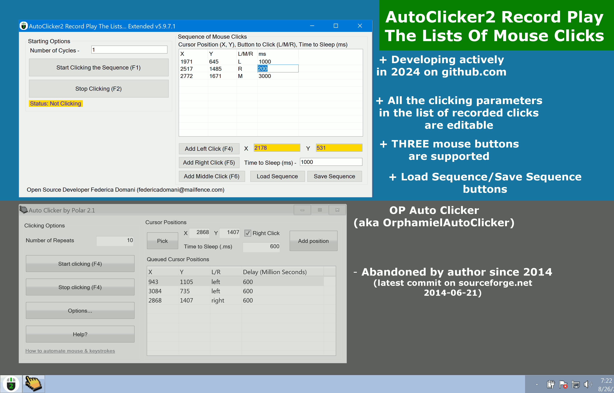
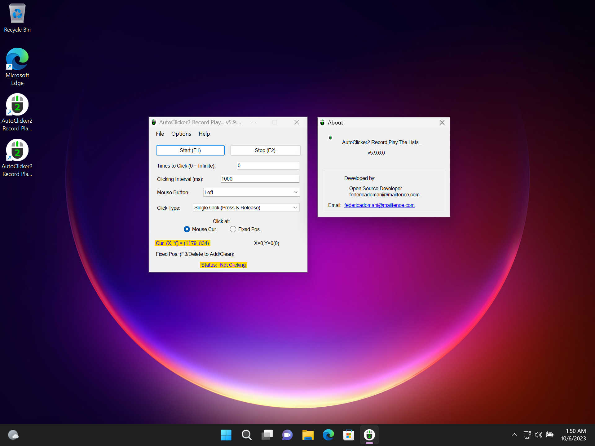 | 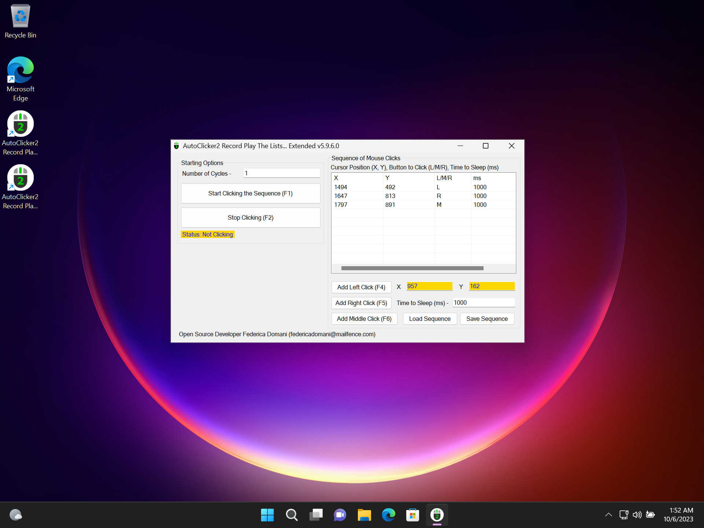

### ChangeLog

* Infinite clicking if number of repeats equals to 0.
* Better GUI emphasizing for Mouse Cur./Fixed Pos. clicking.
* Works on Windows 11!
* AutoClicker2 has got colored the mouse clicking status.
* AutoClicker2Ex has got "Load Sequence" and "Save Sequence" buttons.
* Five mouse buttons to click: Left, Right, Middle, XBUTTON1, XBUTTON2.
* Minor bug fixes.

Found a bug? Create the [issue]({{page.source_issues_url}}){:target="_blank"}!

### Warning

> Old sites:
>  — https://sourceforge.net/projects/autoclicker-professional/
>  — https://sourceforge.net/projects/orphamielautoclicker/
>  — https://www.opautoclicker.com
>  — https://www.asoftwareplus.com/auto-clicker-typer.html
>  are obsolete and abandoned since 2014-2016 (for example, latest commit on sourceforge.net 2014-06-21). The source code of the application and its Windows binaries have not been updated for many years at that sites.
>  <b>Official site is here</b>.

### Rebranding

The project is undergoing re-branding from "RPG AutoClicker Professional Suite for Windows" and "AutoClicker2 Record-Play for Windows" to "{{page.app_name}}". Some text labels in the application and the site may be inconsistent.

## Detailed Description

{{page.app_name}} {{page.app_version}} supports record, edit, debug, import, export, and playback the whole sequences of mouse clicks.

Yes, this is the only mouse auto clicker with strong record/edit/play capabilities for professional work with sequences of mouse clicks.
This is the only open source project that has regular commits into source tree in 2024.
Perfectly compatible with Windows 7, Windows 8, Windows 10, [Windows 11](https://www.microsoft.com/en-us/software-download/windows11){:target="_blank"}, both 32-bit and 64-bit systems.

AutoClicker2 Record Play The Lists Of Mouse Clicks is a new open source replacer of frozen, buggy, suspicious proprietary projects such as
[Orphamiel Auto-Clicker](https://sourceforge.net/projects/orphamielautoclicker/){:target="_blank"},
[OP AutoClicker](https://www.opautoclicker.com){:target="_blank"},
[AutoClicker.io](https://autoclicker.io){:target="_blank"},
[Chrome Browser AutoClicker plugin](https://chrome.google.com/webstore/detail/auto-clicker/cpedeojecpbkcomgcolphimkjdnikbck?hl=en){:target="_blank"},
[AutoClicker.org](https://www.autoclicker.org){:target="_blank"},
[GS Auto Clicker](https://gs-auto-clicker.en.softonic.com){:target="_blank"},
[AutoClicker.pro](https://autoclicker.pro){:target="_blank"},
[Auto Clicker Typer](https://www.asoftwareplus.com/auto-clicker-typer.html){:target="_blank"},
[Macro Recorder](https://www.macrorecorder.com){:target="_blank"},
[ReMouse](https://www.remouse.com){:target="_blank"}, and many others.

Note all of that programs are closed-source clones of each other, have not been updated for
many years and may contain trojan, malware or virus code as well as huge amount of embedded unwanted Ads and spy agents.

Unlike suspicious "free" but proprietary or abandoned programs mentioned above,
AutoClicker2 Record Play The Lists Of Mouse Clicks is 100% open source project, and supports professional gaming in
[Roblox](https://www.roblox.com){:target="_blank"},
[Minecraft](https://en.wikipedia.org/wiki/Minecraft){:target="_blank"},
[Cookie Clicker](https://en.wikipedia.org/wiki/Cookie_Clicker){:target="_blank"},
[Candy Crush Saga](https://en.wikipedia.org/wiki/Candy_Crush_Saga){:target="_blank"}, etc.

Also AutoClicker2 import/export features over mouse clicking sequences discover professional
[Quality Assurance](https://en.wikipedia.org/wiki/Quality_assurance){:target="_blank"} usage.

{{page.app_name}} is a mature mouse clicker framework for Windows that can record, save, play and randomize the whole groups/sequences/lists of mouse clicks/actions/events as well as operate with fine structures of clicking sequences to vary mouse button, time interval between clicks and much more.
As its predecessors, AutoClicker2 is a full-fledged autoclicker with two modes of autoclicking, at your dynamic cursor location or at a prespecified location. The maximum amounts of clicked can also be set (or left as infinite).

{{page.app_name}} can click: 1) at current mouse position on your PC desktop 2) via a sequence of user-defined mouse coordinates that can be recorded and stored into a text file 3) at random points in a bounding rectangle determined automatically on arbitrary clicking sequence recorded previously and saved to a file.

{{page.app_name}} Extended can operate with fine structures of clicking groups/sequences/lists. It allows to record the mouse actions with different clicking buttons, time intervals, etc.

No more performing mouse clicks manually!
With AutoClicker2 Record Play The Lists Of Mouse Clicks, you can automate the task of clicking repeatedly on a particular point on the PC screen.
Depending on the target point and clicking speed, number of clicks, mouse button, and other parameters, an action will be performed
on your PC display on a fixed location, or through a sequence of mouse clicks you previously recorded, edited, and debugged.

You can use this software to continuously automate mouse clicks on any part of PC display and can easily keep the automated tasks running over night or few days.

## Features

Most important features of {{page.app_name}} are listed here.

* Choose whether to follow your mouse cursor or click at a fixed spot or even record and replay a whole sequence of mouse clicks
* Supports clicking even when the application's window is minimized (in the background mode)
* Allows arbitrary key to trigger mouse clicks (selected by user)
* Not only Left, Righ, and Middle mouse buttons are supported for clicking, but all FIVE mouse buttons of any professional gaming mouse
* Hotkeys work in the background for convenience
* Can generate Single, Double, Triple and Press-only (Hold The Mouse Button) click events
* Preserves all the clicking settings and saves them automatically between application's run-times
* Set the number of times to click (or select unlimited looped clicking for number = 0)
* Free and Open Source forever without Ads, viruses or malware
* The program has built-in Updater Service under construction that may perform additional scientific tasks when your CPU is idle with very tiny CPU and Internet usage. See source code of the installer. The application uninstalls clearly and is NOT a virus or malware. You may switch to the installers without Updater Service and back [in any moment](https://github.com/federicadomani/AutoClicker2-Record-Play-The-Lists-Of-Mouse-Clicks/blob/master/Installer/README.md).
* Clean and simple Graphical User Interface
* NEW. Trigger key defaults to DELETE that clears the clicking sequence is now changeable as other trigger keys. You may select another key if DELETE trigger affects other applications
* NEW. Menu item "Save for random clicking" has been added for your convenience. Just record arbitrary amount of points to form a bounding rectangle by pressing "F3" in "Fixed Pos." mode than do "File"->"Save for random clicking", select desired file name, remember it and load the file back via "File"->"Load"
* NEW. {{page.app_name}} Extended adds Fine Structure Of Clicking Sequences. It allows to record the mouse actions with different clicking buttons, time intervals, etc.
* BRAND NEW. Added professional gaming mouse buttons XBUTTON1, XBUTTON2 to emulate clicks.

## More info from the community fun site

According to [top-10-mouse-auto-clickers.best](https://top-10-mouse-auto-clickers.best/),
AutoClicker2 Record Play The Lists Of Mouse Clicks is the world's top 2 mouse auto clicker application in 2024.
They recognize AutoClicker2 Record Play as a full-fledged autoclicker with two modes of auto-clicking,
at your dynamic cursor location or at a prespecified location. The maximum amounts of clicks can also be set (or left infinite).
Hotkeys work in the background for convenience. AutoClicker2 automates your mouse clicks at certain points.
It is used for various video games and other applications. It can create, record and playback a macro of any critical combinations
you press into your keyboard and mouse. AutoClicker2 is a task automation software that saves you from the trouble of repeatedly clicking
on the screen. It is an actively developed open source project with GitHub stars and downloads growing dramatically.

## Screenshots

### Screenshots for the version 5.9.6.0 on Windows 11

* {{page.app_name}} version 5.9.6.0 on Windows 11 (standard app).

* {{page.app_name_ex}} version 5.9.6.0 on Windows 11 (extended app).

### Screenshots for another previous versions

* {{page.app_name}} version 5.9.5.1 vs. Op AutoClicker (aka OrphamielAutoClicker) - Single Clicking Mode.

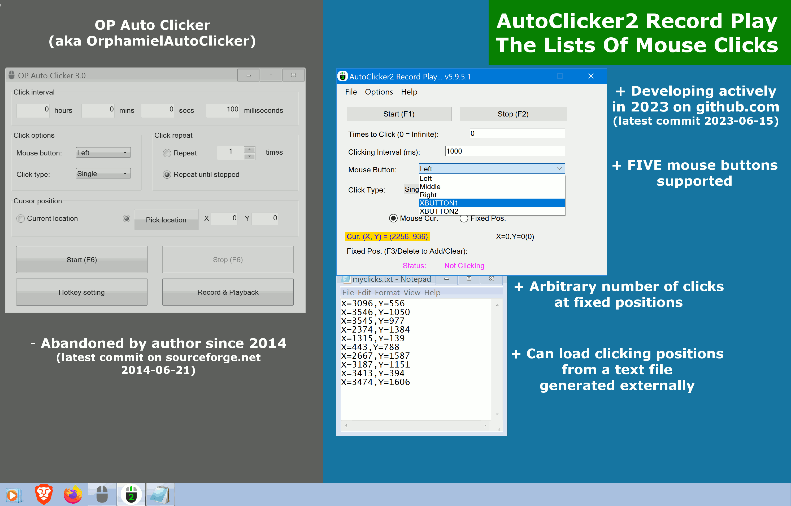

* {{page.app_name_ex}} version 5.9.5.1 vs. Op AutoClicker (aka OrphamielAutoClicker) - Group Clicking Mode.

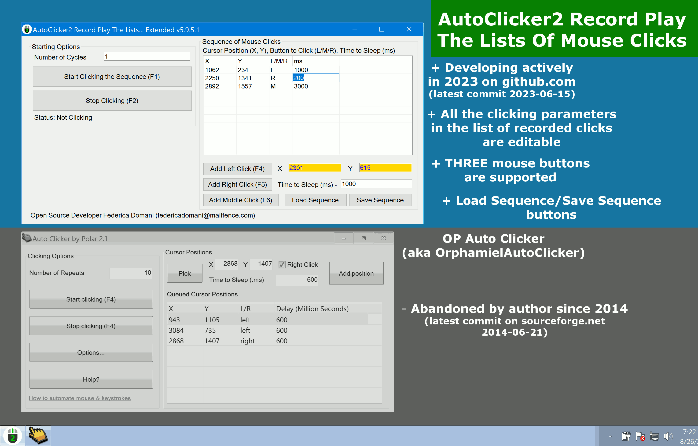

* {{page.app_name_ex}} version 5.9.5.1 - Sequence of mouse clicks recorded and loaded from a text file.

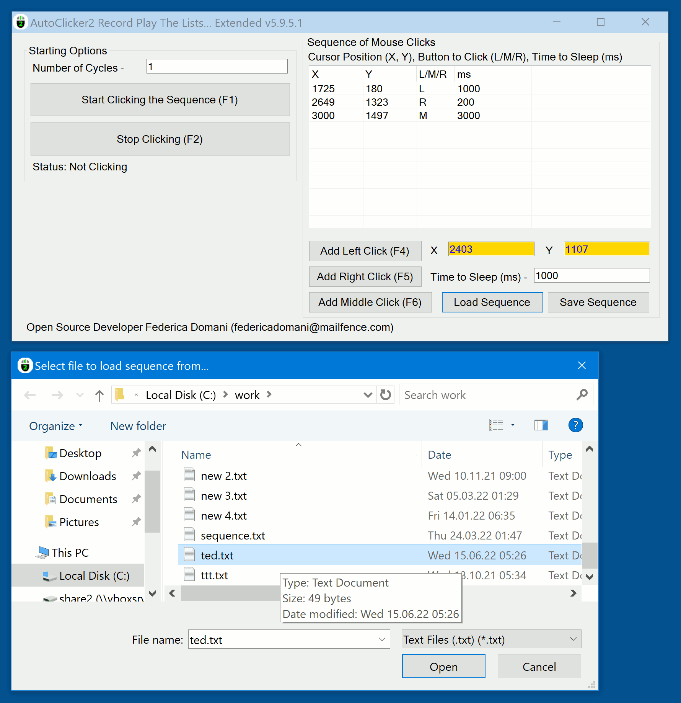

### Screencast video for the previous version 5.9.3.1

How to download, install and use {{page.app_name}} v5.9.3.1.

<iframe style="aspect-ratio: 16/9; width: 100%;" src="https://www.youtube.com/embed/jscqOm4OeKM" title="YouTube video player" frameborder="0" allow="accelerometer; autoplay; clipboard-write; encrypted-media; gyroscope; picture-in-picture; web-share" allowfullscreen></iframe>

Formerly "AutoClicker2 Record-Play for Windows" and "RPG AutoClicker Professional Suite for Windows" - that names one can see on old screenshots.

## Quick user manual in screenshots

### {{page.app_name}} - How to select the hotkeys to trigger mouse clicking events.

Run the app named AutoClicker2.exe. In the main window menu select Options->Hotkeys. Modal window appears. Click the button representing each hotkey.
Press new hotkey. Close the window.

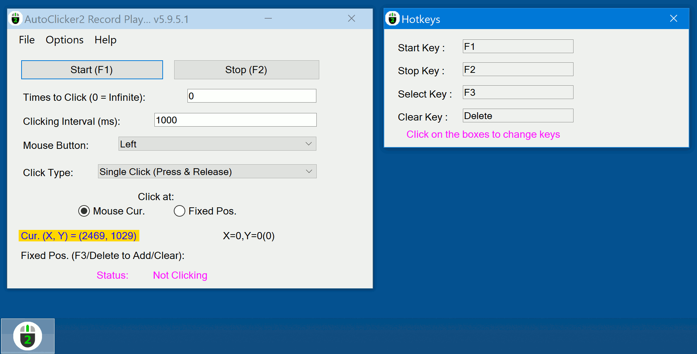

### {{page.app_name}} - How to save the mouse clicking sequence that has been recorded.

Run the app named AutoClicker2.exe. In the main window click on the radio button "Fixed Pos.". Move the mouse around the screen. Where desired, press the key that adds
a mouse click to the sequence. Default key is F3. A text label below the radio button "Fixed Pos." shows X and Y coordinates of the last clicking event and total number
of clicks in the sequence recorded (shown in brackets). In the main window menu select File->Save. Then choose a name for simple text file where the clicking sequence will
be stored.

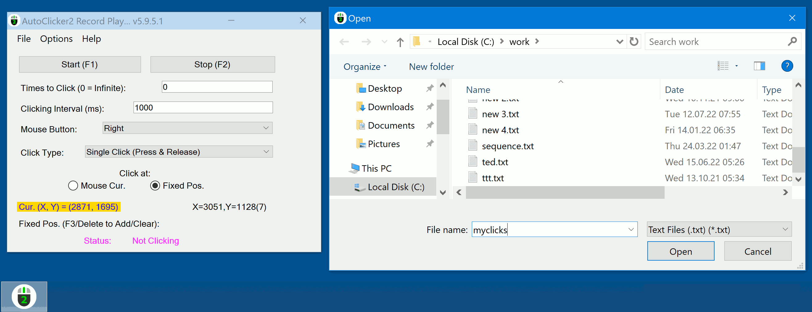

### {{page.app_name}} - How to record a mouse clicking sequence.

Run the app named AutoClicker2.exe. In the main window click on the radio button "Fixed Pos.". Move the mouse around the screen. Where desired, press the key that adds
a mouse click to the sequence. A yellow text label below and left the radio button "Fixed Pos." shows current mouse position,
while text label below and right the radio button "Fixed Pos." shows the last recorded mouse clicking event and number of events in the sequence (in the brackets).

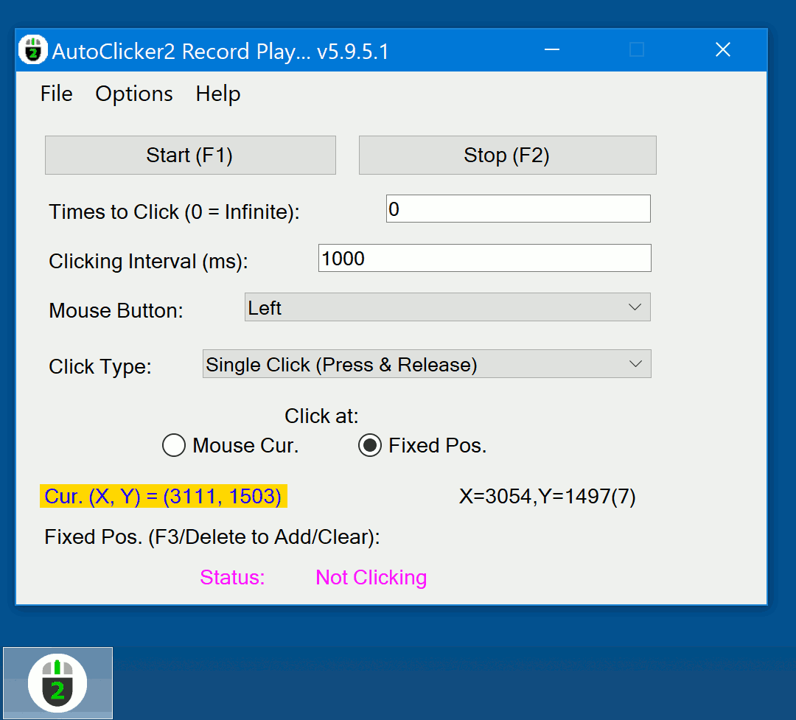

### {{page.app_name}} - How to save a mouse clicking sequence into a simple text file.

Now your clicking sequence is recorded and being stored in a computer's RAM. You wish to save it on disk.
In the main window menu select File->Save. Then choose a name for simple text file where the clicking sequence will
be stored. You can use the text file saved with the clicking sequence recorded in any other Windows application. As well as any other app can generate a simple text file
with mouse clicking sequence to be loaded into AutoClicker2.

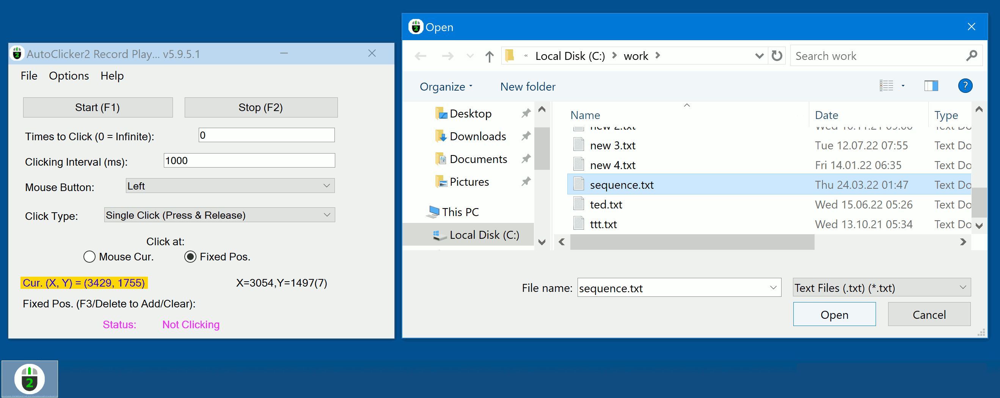

### {{page.app_name}} - How to delete the whole mouse clicking sequence that was just recorded.

We assume you have just recorded a new mouse clicking sequence. In the main window press the key that wipes the whole sequence recorded. Default key is DELETE.
A text label below and right the radio button "Fixed Pos." shows the last recorded mouse clicking event and number of events in the sequence (in the brackets).
When you press the DELETE key, this label shows "X=0,Y=0(0)", indicating there is no more clicking sequence in the computer's RAM.

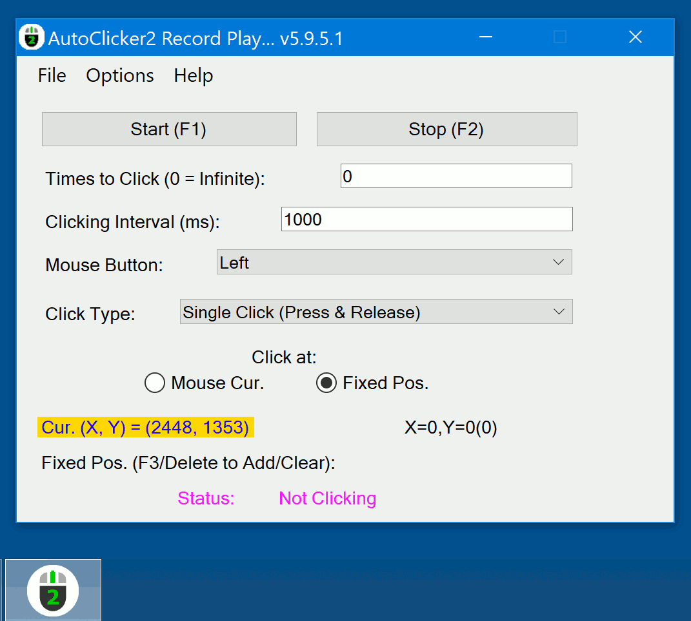

### {{page.app_name}} - How to load a mouse clicking sequence previously recorded.

Run the app named AutoClicker2.exe. In the main window menu select File->Load. A standard system modal window appears to choose a simple text file
with mouse clicking sequence inside. If the file contains an error, AutoClicker2 will inform you. Otherwise, the app loads a new clicking sequence from a file.

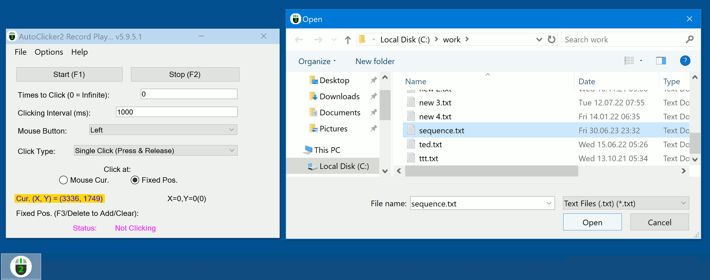

### {{page.app_name}} - How to load a mouse clicking sequence previously recorded. What else?

When the app named AutoClicker2.exe loads a new clicking sequence from a file,
a text label below and right the radio button "Fixed Pos." shows the last recorded mouse clicking event and number of events in the sequence (in the brackets).
You can now work with this clicking sequence exactly as if it were just recorded by your hands.
Furthermore, you can open a text file with your sequence in any text editor like Notepad and make arbitrary corrections to the clicking sequence.

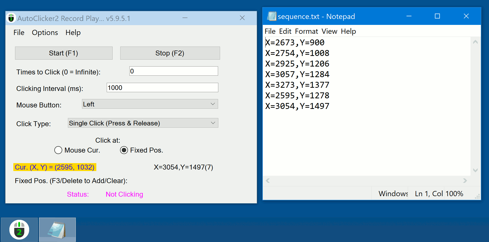

### {{page.app_name_ex}} - How to load a mouse clicking sequence from a text file.

Run the app named AutoClicker2Ex.exe (another app in the suite of two programs). In the main window click on the "Load Sequence" button.
Standard Windows dialog appears to choose a text file with mouse clicking sequence to load.

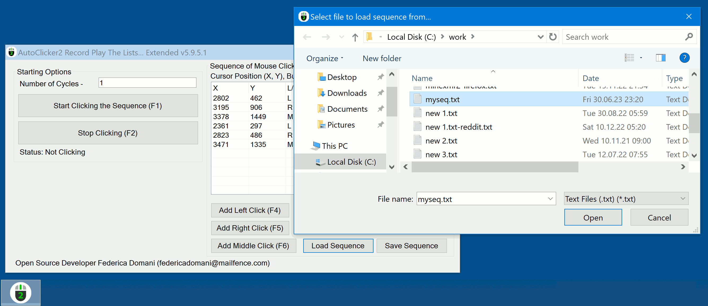

### {{page.app_name_ex}} - How to record a new mouse clicking sequence.

Run the app named AutoClicker2Ex.exe. In the main window click one of the following buttons:

* "Add Left Click (F4)" to add a left mouse button clicking event to the sequence being recorded;
* "Add Right Click (F5)" to add a right mouse button clicking event to the sequence being recorded;
* "Add Middle Click (F6)" to add a middle mouse button clicking event to the sequence being recorded.

Once a button described above is being clicked, the corresponding mouse event is being added to the list resides in a top right part of the main window.

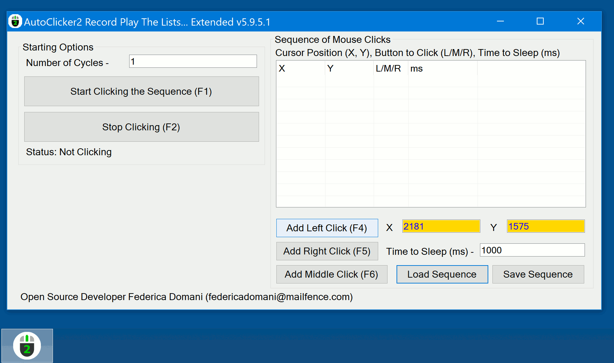

### {{page.app_name_ex}} - How to edit a mouse clicking sequence.

We assume AutoClicker2Ex.exe is running and few clicking events have been added to the sequence. Look at the list resides in a top right part of the main window.
Now you can edit each column of the list. First column contains X-coordinate of the clicking event.
Second column contains Y-coordinate of the clicking event. Third column contains a mouse button to click (L-Left, M-Middle, R-Right).
Fourth column contains a time interval to the next click in milliseconds.

You can edit the list by double-clicking on the column and row you wish to modify, then type a new parameter value. This is a standard Windows list widget.
To modify mouse button, after double click to the corresponding column/row, you can type L/l (for left mouse button), M/m (for middle mouse button), R/r (for right mouse button),
regardless a letter case.

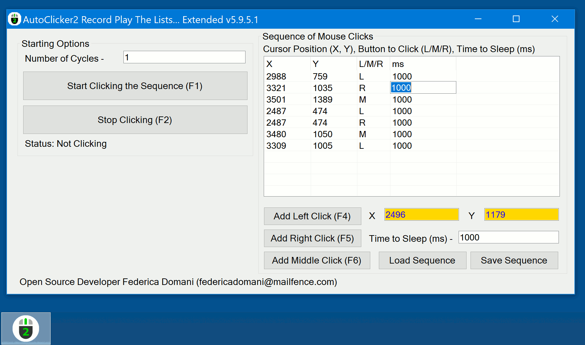

### {{page.app_name_ex}} - How to save a mouse clicking sequence to a text file.

We assume AutoClicker2Ex.exe is running and few clicking events have been added/edited. In the main window click on the "Save Sequence" button.
Standard Windows dialog appears to choose a text file name to save to it a mouse clicking sequence.

Please note, simple text file format is not the same for AutoClicker2.exe and AutoClicker2Ex.exe, because AutoClicker2Ex.exe allows you to store more parameters
for each clicking event in the sequence.

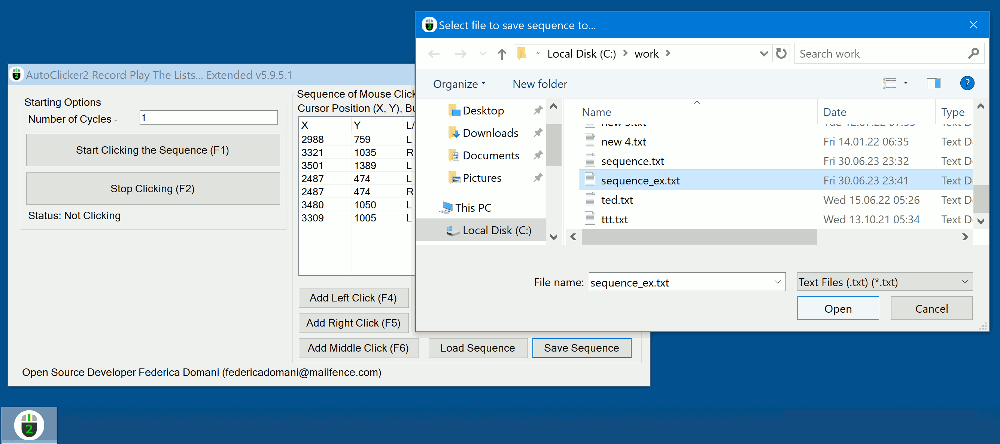

### {{page.app_name_ex}} - How to load a mouse clicking sequence from a text file. What else?

Close and run the app named AutoClicker2Ex.exe again. You see there is no working mouse clicking sequence in the list.
Ok, then in the main window click on the "Load Sequence" button.
Standard Windows dialog appears to choose a text file with mouse clicking sequence to load.
Select a text file with previously recorded sequence and click on the "Open" button.
If a file contains no error, new clicking sequence will be loaded from a file to the working list.
You can then playback or edit the sequence as usual.

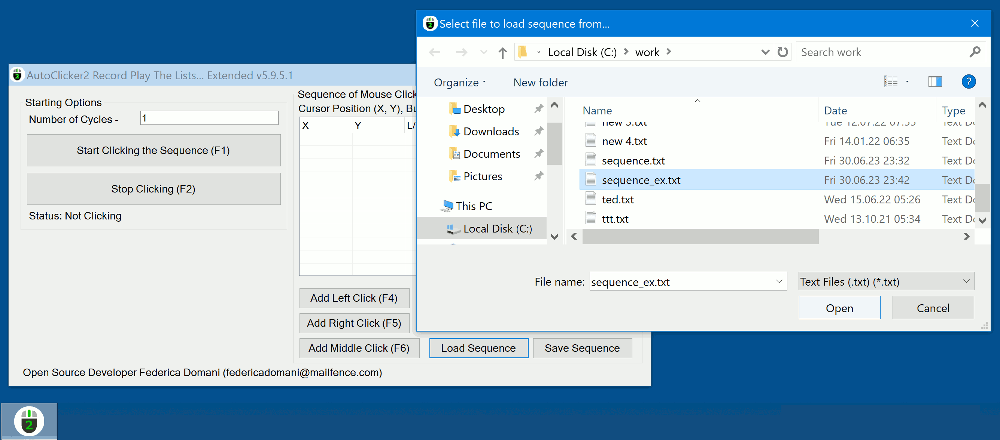

## Workaround Windows UAC

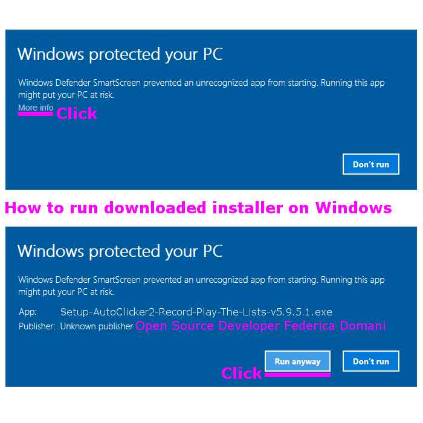

## Build

Build with MS Visual Studio 2013.
Programming language: C#.

## Contacts

**[federicadomani@mailfence.com](mailto:federicadomani@mailfence.com)**
