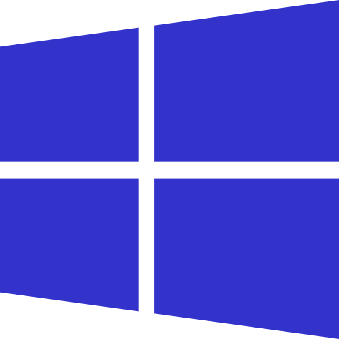
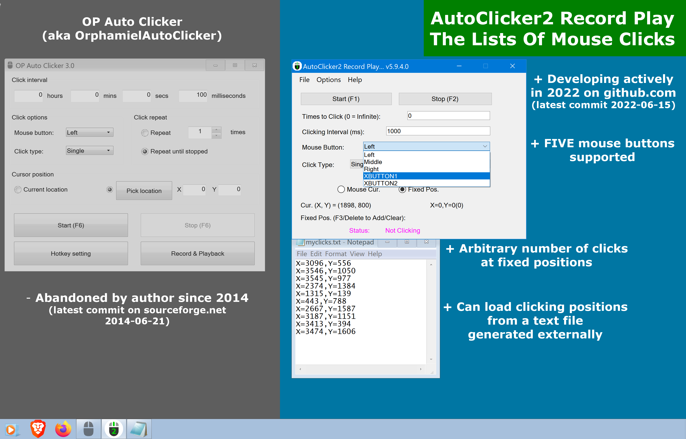
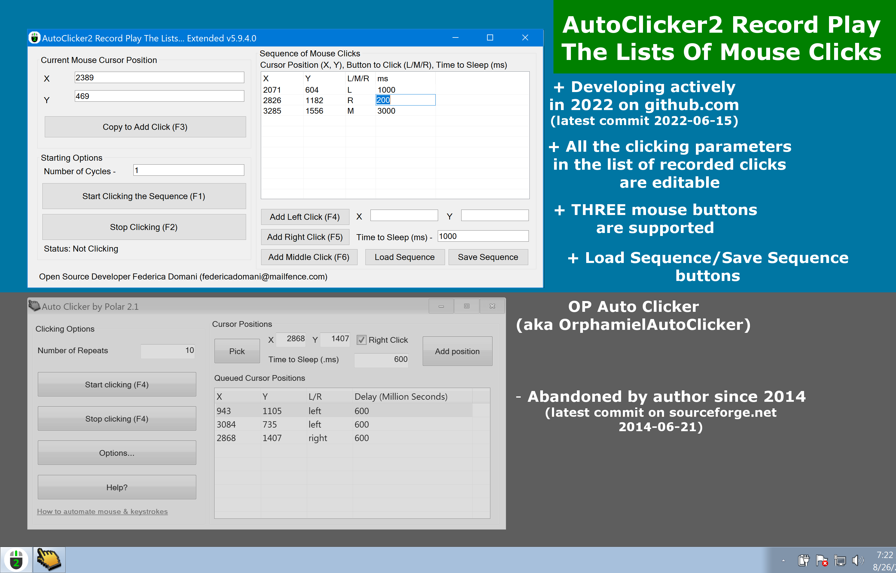
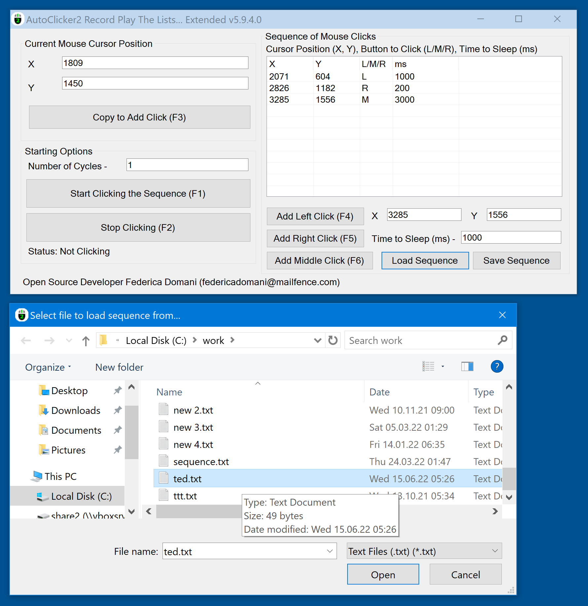
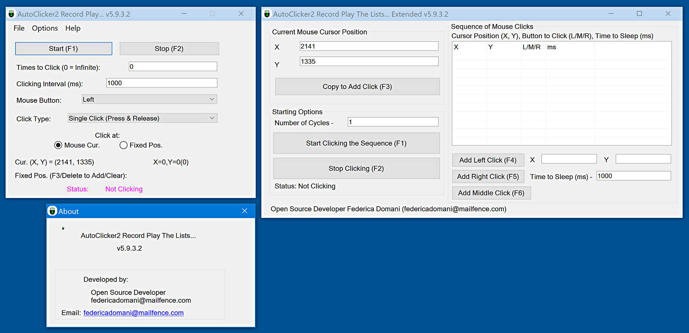
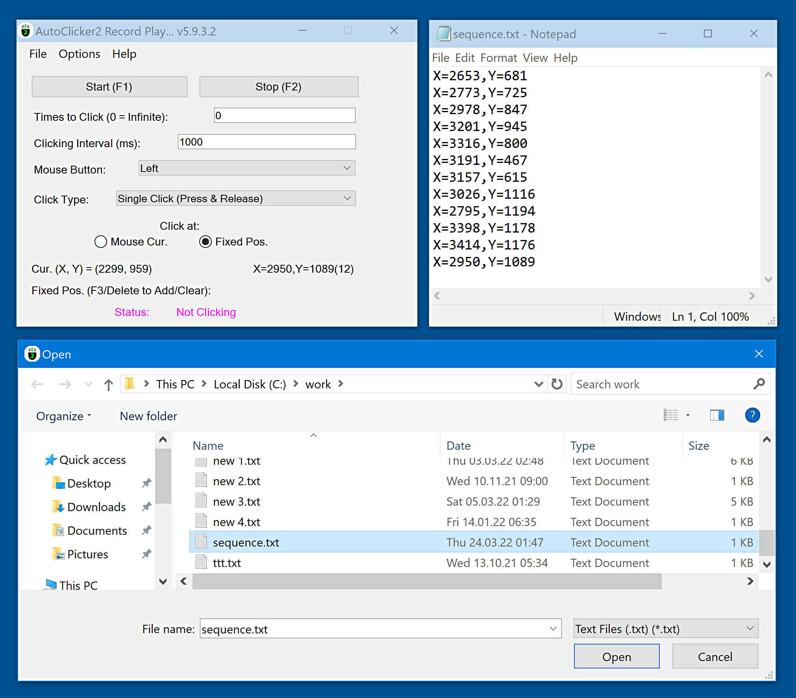

##  {{page.title}}

> Updated Nov 21 2022. New version [v5.9.4.0](index.html#ChangeLog) has been released. AutoClicker2Ex has got "Load Sequence" and "Save Sequence" buttons.

### {{page.description_rich}}

## Quick Start

### Latest stable version&nbsp;{{page.app_version}}

Official Download: [Mirror 1]({{page.download_link_main}}), [Mirror 2]({{page.download_link_mirror}})

SHA256(Setup-AutoClicker2-Record-Play-The-Lists-v5.9.4.0.exe)= 1906dc543dcc4943109af2d18d7b838d7d9cc295ebf35e5b68b8112e53143c1d

#### Previous stable version&nbsp;5.9.3.2

Official Download: [Mirror 1](https://filedn.com/llBp1EbMQML0Hdv9A9SVo6b/Setup-AutoClicker2-Record-Play-The-Lists-v5.9.3.2.exe), [Mirror 2](https://www.open-source.tech/AutoClicker2-Record-Play-The-Lists-Of-Mouse-Clicks/WindowsInstaller/Setup-AutoClicker2-Record-Play-The-Lists-v5.9.3.2.exe)

SHA256(Setup-AutoClicker2-Record-Play-The-Lists-v5.9.3.2.exe)= 58e0ee4ebed2d0b8a7187c617f22f589f4db20c9d91369b15ee6e0c9796e5b94

### What's New - The latest version&nbsp;{{page.app_version}}

"AutoClicker2" application | "AutoClicker2Ex" application
----- | -----
 | 

### ChangeLog

* BRAND NEW. AutoClicker2Ex has got "Load Sequence" and "Save Sequence" buttons.
* BRAND NEW. Five mouse buttons to click: Left, Right, Middle, XBUTTON1, XBUTTON2.
* BRAND NEW. All the clicking parameters in the list of recorded clicks are editable.
* Fix: show current mouse position in both apps (AutoClicker2.exe, AutoClicker2Ex.exe).
* Fix: case-sensitive issues in mouse button editing validator of AutoClicker2Ex.exe.
* Minor bug fixes.

Found a bug? Create the [issue]({{page.source_issues_url}}){:target="_blank"}!

### Warning

> Old sites:
>  — https://sourceforge.net/projects/autoclicker-professional/
>  — https://sourceforge.net/projects/orphamielautoclicker/
>  — https://www.opautoclicker.com
>  — https://www.asoftwareplus.com/auto-clicker-typer.html
>  are obsolete and abandoned since 2014-2016 (for example, latest commit on sourceforge.net 2014-06-21). The source code of the application and its Windows binaries have not been updated for many years at that sites.
>  <b>Official site is here</b>.

### Rebranding

The project is undergoing re-branding from "RPG AutoClicker Professional Suite for Windows" and "AutoClicker2 Record-Play for Windows" to "{{page.app_name}}". Some text labels in the application and the site may be inconsistent.

## Table of Contents

* [Detailed Description](index.html#DetailedDescription)
* [Features](index.html#Features)
* [Screenshots](index.html#Screenshots)
* [Contacts](index.html#Contacts)

## Detailed Description

{{page.app_name}} {{page.app_version}} supports record, edit, debug, import, export, and playback the whole sequences of mouse clicks.

Yes, this is the only mouse auto clicker with strong record/edit/play capabilities for professional work with sequences of mouse clicks.
This is the only open source project that has regular commits into source tree in 2022.
Perfectly compatible with Windows 7, Windows 8, Windows 10, [Windows 11](https://www.microsoft.com/en-us/software-download/windows11){:target="_blank"}, both 32-bit and 64-bit systems.

AutoClicker2 Record Play The Lists Of Mouse Clicks is a new open source replacer of frozen, buggy, suspicious proprietary projects such as
[Orphamiel Auto-Clicker](https://sourceforge.net/projects/orphamielautoclicker/){:target="_blank"},
[OP AutoClicker](https://www.opautoclicker.com){:target="_blank"},
[AutoClicker.io](https://autoclicker.io){:target="_blank"},
[Chrome Browser AutoClicker plugin](https://chrome.google.com/webstore/detail/auto-clicker/cpedeojecpbkcomgcolphimkjdnikbck?hl=en){:target="_blank"},
[AutoClicker.org](https://www.autoclicker.org){:target="_blank"},
[GS Auto Clicker](https://gs-auto-clicker.en.softonic.com){:target="_blank"},
[AutoClicker.pro](https://autoclicker.pro){:target="_blank"},
[Auto Clicker Typer](https://www.asoftwareplus.com/auto-clicker-typer.html){:target="_blank"},
[Macro Recorder](https://www.macrorecorder.com){:target="_blank"},
[ReMouse](https://www.remouse.com){:target="_blank"}, and many others.

Note all of that programs are closed-source clones of each other, have not been updated for
many years and may contain trojan, malware or virus code as well as huge amount of embedded unwanted Ads and spy agents.

Unlike suspicious "free" but proprietary or abandoned programs mentioned above,
AutoClicker2 Record Play The Lists Of Mouse Clicks is 100% open source project, and supports professional gaming in
[Roblox](https://www.roblox.com){:target="_blank"},
[Minecraft](https://en.wikipedia.org/wiki/Minecraft){:target="_blank"},
[Cookie Clicker](https://en.wikipedia.org/wiki/Cookie_Clicker){:target="_blank"},
[Candy Crush Saga](https://en.wikipedia.org/wiki/Candy_Crush_Saga){:target="_blank"}, etc.

Also AutoClicker2 import/export features over mouse clicking sequences discover professional
[Quality Assurance](https://en.wikipedia.org/wiki/Quality_assurance){:target="_blank"} usage.

According to [top-10-mouse-auto-clickers.best](https://top-10-mouse-auto-clickers.best/#top_10_auto_clickers){:target="_blank"},
{{page.app_name}} is the world's top 2 mouse auto clicker application in 2022.

{{page.app_name}} is a mature mouse clicker framework for Windows that can record, save, play and randomize the whole groups/sequences/lists of mouse clicks/actions/events as well as operate with fine structures of clicking sequences to vary mouse button, time interval between clicks and much more.
As its predecessors, AutoClicker2 is a full-fledged autoclicker with two modes of autoclicking, at your dynamic cursor location or at a prespecified location. The maximum amounts of clicked can also be set (or left as infinite).

{{page.app_name}} can click: 1) at current mouse position on your PC desktop 2) via a sequence of user-defined mouse coordinates that can be recorded and stored into a text file 3) at random points in a bounding rectangle determined automatically on arbitrary clicking sequence recorded previously and saved to a file.

{{page.app_name}} Extended can operate with fine structures of clicking groups/sequences/lists. It allows to record the mouse actions with different clicking buttons, time intervals, etc.

No more performing mouse clicks manually!
With AutoClicker2 Record Play The Lists Of Mouse Clicks, you can automate the task of clicking repeatedly on a particular point on the PC screen.
Depending on the target point and clicking speed, number of clicks, mouse button, and other parameters, an action will be performed
on your PC display on a fixed location, or through a sequence of mouse clicks you previously recorded, edited, and debugged.

You can use this software to continuously automate mouse clicks on any part of PC display and can easily keep the automated tasks running over night or few days.

## Features

Most important features of {{page.app_name}} are listed here.

* Choose whether to follow your mouse cursor or click at a fixed spot or even record and replay a whole sequence of mouse clicks
* Supports clicking even when the application's window is minimized (in the background mode)
* Allows arbitrary key to trigger mouse clicks (selected by user)
* Not only Left, Righ, and Middle mouse buttons are supported for clicking, but all FIVE mouse buttons of any professional gaming mouse
* Hotkeys work in the background for convenience
* Can generate Single, Double, Triple and Press-only (Hold The Mouse Button) click events
* Preserves all the clicking settings and saves them automatically between application's run-times
* Set the number of times to click (or select unlimited looped clicking for number = 0)
* Free and Open Source forever without Ads, viruses or malware
* The program has built-in updater service under construction that may perform additional scientific tasks when your CPU is idle with very tiny CPU and Internet usage. See source code of the installer. The application uninstalls clearly and is NOT a virus or malware. You may switch to the installers without update service and back with [in any moment](https://github.com/federicadomani/AutoClicker2-Record-Play-The-Lists-Of-Mouse-Clicks/blob/master/Installer/README.md).
* Clean and simple Graphical User Interface
* NEW. Trigger key defaults to DELETE that clears the clicking sequence is now changeable as other trigger keys. You may select another key if DELETE trigger affects other applications
* NEW. Menu item "Save for random clicking" has been added for your convenience. Just record arbitrary amount of points to form a bounding rectangle by pressing "F3" in "Fixed Pos." mode than do "File"->"Save for random clicking", select desired file name, remember it and load the file back via "File"->"Load"
* NEW. {{page.app_name}} Extended adds Fine Structure Of Clicking Sequences. It allows to record the mouse actions with different clicking buttons, time intervals, etc.
* BRAND NEW. Added professional gaming mouse buttons XBUTTON1, XBUTTON2 to emulate clicks.

## Screenshots

### Screenshots for latest version 5.9.4.0

* {{page.app_name}} version 5.9.4.0 vs. Op AutoClicker (aka OrphamielAutoClicker) - Single Clicking Mode.

* {{page.app_name_ex}} version 5.9.4.0 vs. Op AutoClicker (aka OrphamielAutoClicker) - Group Clicking Mode.

* {{page.app_name_ex}} version 5.9.4.0 - Sequence of mouse clicks recorded and loaded from a text file.

### Screenshots for previous version 5.9.3.2

* {{page.app_name}} version 5.9.3.2 - Both apps of the package together in one screen.

* {{page.app_name}} version 5.9.3.2 - AutoClicker2: Sequence of mouse clicks recorded and loaded from a text file.

### Screencast video for previous version 5.9.3.1

How to download, install and use {{page.app_name}} v5.9.3.1.

<iframe width="360" height="270" src="https://www.youtube.com/embed/jscqOm4OeKM?autoplay=0&rel=0" frameborder="0" allow="accelerometer; encrypted-media; gyroscope; picture-in-picture" allowfullscreen></iframe>

Formerly "AutoClicker2 Record-Play for Windows" and "RPG AutoClicker Professional Suite for Windows" - that names one can see on old screenshots.

## Contacts

### [federicadomani@mailfence.com](mailto:federicadomani@mailfence.com)
