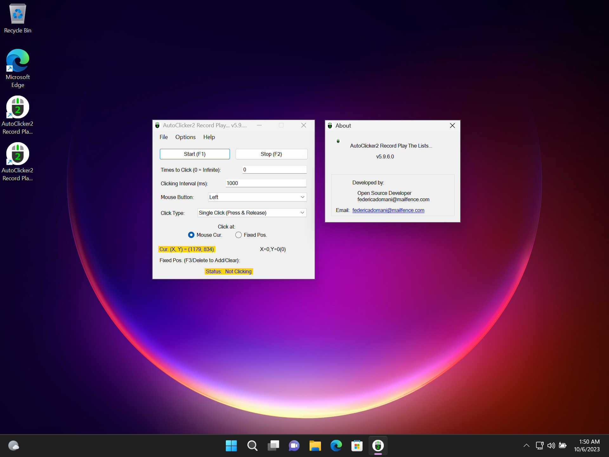

> Actualizado 26 de Diciembre 2024. Añadido traducción al Español.

**{{page.description_rich}}**

**[YouTube (en Inglés)](https://youtu.be/G_6V7-We-kw)**

## Inicio Rápido

### Última versión estable&nbsp;{{page.app_version}}

Descargas Oficiales: <a class="downloads" href="{{ page.download_link_main }}">&nbsp;Installer de Windows</a>

### Lo nuevo - La última versión&nbsp;{{page.app_version}}

"AutoClicker2" vs. OP Auto Clicker | "AutoClicker2Ex" vs. OP Auto Clicker
----- | -----
 | 
 | 

### Lista de Cambios

* Mejor GUI enfatizando para hacer clic en la posición actual del ratón o posición fija.
* Nueva versión 5.9.7.1 funciona en Windows 11!
* AutoClicker2 tiene coloreado el estado de clic del ratón.
* AutoClicker2 Ex tiene botones "Cargar Secuencia" y "Salvar Secuencia".
* Cinco botones del ratón para hacer clic: Izquierda, Derecha, Medio, XBUTTON1, XBUTTON2.
* Arreglos menores.

¿Encontraste un bicho? ¡Crea el [problema]({{page.source_issues_url}}){:target="_blank"}!

### Advertencia

> Los sitios antiguos:
>  — https://sourceforge.net/projects/autoclicker-professional/
>  — https://sourceforge.net/projects/orphamielautoclicker/
>  — https://www.opautoclicker.com
>  — https://www.asoftwareplus.com/auto-clicker-typer.html
>  son obsoletos y abandonados desde 2014-2016 (por ejemplo, el último compromiso en sourceforge.net 2014-06-21). El código fuente de la aplicación y sus binarios de Windows no se han actualizado durante muchos años en esos sitios.
>  <b>El sitio oficial está aquí</b>.

## Funcionamiento de Windows UAC

## Construir

Construir con MS Visual Studio 2013.
Lenguaje de programación: C#.

## Contactos

**[federicadomani@mailfence.com](mailto:federicadomani@mailfence.com)**
