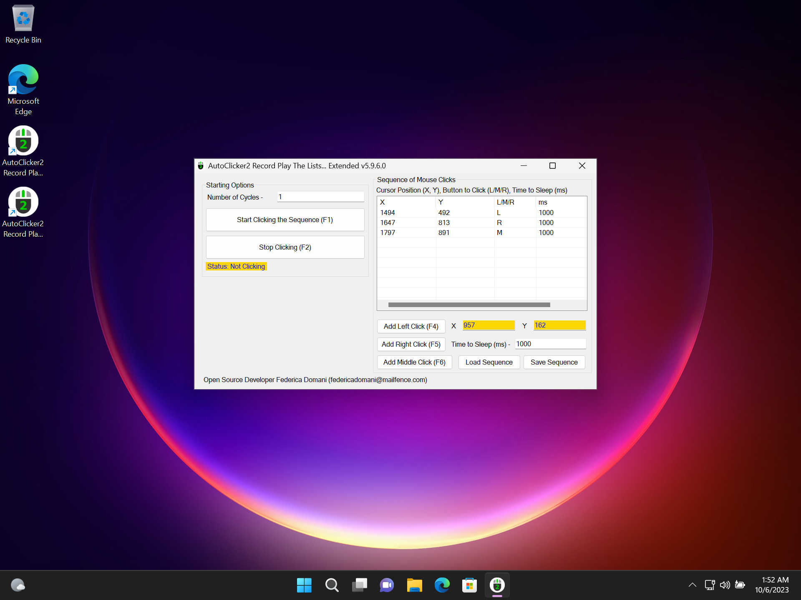
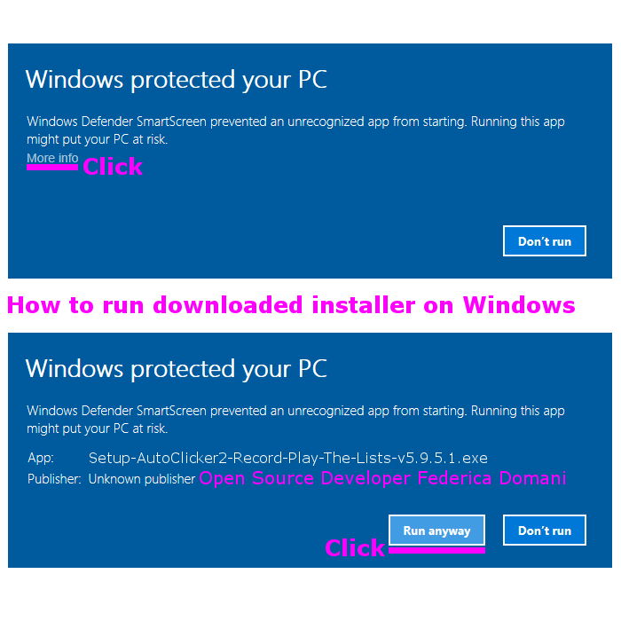

> Actualizado {{ site.bdate }}.

**{{page.description_rich}}**

## Última versión estable&nbsp;{{page.app_version}}

 | 

Marque esta aplicación como <b style="color: #fff;">LIMPIA</b> en su software antivirus.

Descargas Oficiales: <a class="downloads" href="{{ page.download_link_main }}">&nbsp;{{ page.show_downloads_windows_installer }}</a>

    <iframe
        width="280"
        height="498"
        src="https://www.youtube.com/embed/38gmQLTpMYU?rel=0&modestbranding=1"
        title="Cómo usar OP Auto Clicker en Minecraft Java en 2025"
        frameborder="0"
        allow="accelerometer; autoplay; clipboard-write; encrypted-media; gyroscope; picture-in-picture"
        allowfullscreen
        loading="lazy" >
    </iframe>
    

**¡Más de 12357 visitas en Youtube!**

## Inicio Rápido

### Última versión estable&nbsp;{{page.app_version}}

Marque esta aplicación como <b style="color: #fff;">LIMPIA</b> en su software antivirus.

Descargas Oficiales: <a class="downloads" href="{{ page.download_link_main }}">&nbsp;{{ page.show_downloads_windows_installer }}</a>

### Lo nuevo - La última versión&nbsp;{{page.app_version}}

"AutoClicker2" vs. OP Auto Clicker | "AutoClicker2Ex" vs. OP Auto Clicker
----- | -----
 | 
 | 

### Lista de Cambios

* Clics infinitos si el número de repeticiones es igual a 0.
* Mejor GUI enfatizando para hacer clic en la posición actual del ratón o posición fija.
* Funciona en Windows 11!
* AutoClicker2 tiene coloreado el estado de clic del ratón.
* AutoClicker2 Ex tiene botones "Cargar Secuencia" y "Salvar Secuencia".
* Cinco botones del ratón para hacer clic: Izquierda, Derecha, Medio, XBUTTON1, XBUTTON2.
* Arreglos menores.

¿Encontraste un bicho? ¡Crea el [problema]({{page.source_issues_url}}){:target="_blank"}!

### Advertencia

> Los sitios antiguos:
>  — https://sourceforge.net/projects/autoclicker-professional/
>  — https://sourceforge.net/projects/orphamielautoclicker/
>  — https://www.opautoclicker.com
>  — https://www.asoftwareplus.com/auto-clicker-typer.html
>  son obsoletos y abandonados desde 2014-2016 (por ejemplo, el último compromiso en sourceforge.net 2014-06-21). El código fuente de la aplicación y sus binarios de Windows no se han actualizado durante muchos años en esos sitios.
>  <b>El sitio oficial está aquí</b>.

## Características

Aquí se enumeran las características más importantes de {{page.app_name}}.

* Elija si desea seguir el cursor del ratón, hacer clic en un punto fijo o incluso grabar y reproducir una secuencia completa de clics.
* Permite hacer clic incluso con la ventana de la aplicación minimizada (en segundo plano).
* Permite que cualquier tecla active los clics (seleccionada por el usuario).
* No solo se admiten los botones izquierdo, derecho y central del ratón para hacer clic, sino también los cinco botones de cualquier ratón profesional para juegos.
* Las teclas de acceso rápido funcionan en segundo plano para mayor comodidad.
* Puede generar eventos de clic simple, doble, triple y de solo pulsación (mantener pulsado el botón del ratón).
* Conserva todas las configuraciones de clic y las guarda automáticamente entre los tiempos de ejecución de la aplicación.
* Establezca el número de clics (o seleccione clics en bucle ilimitados para un número = 0).
* Gratis y de código abierto para siempre, sin anuncios, virus ni malware.
* El programa cuenta con un servicio de actualización integrado en desarrollo que puede realizar tareas científicas adicionales cuando la CPU está inactiva con un uso mínimo de la CPU y de Internet. Consulte el código fuente del instalador. La aplicación se desinstala fácilmente y NO es un virus ni malware. Puede cambiar a los instaladores sin el Servicio de Actualización y volver [en cualquier momento](https://github.com/federicadomani/AutoClicker2-Record-Play-The-Lists-Of-Mouse-Clicks/blob/master/Installer/README.md).
* Interfaz gráfica de usuario limpia y sencilla.
* NUEVO. La tecla de activación predeterminada es SUPR, que borra la secuencia de clics. Ahora se puede cambiar como otras teclas de activación. Puede seleccionar otra tecla si SUPR afecta a otras aplicaciones.
* NUEVO. Se ha añadido la opción de menú "Guardar para clics aleatorios" para su comodidad. Simplemente registre una cantidad arbitraria de puntos para formar un rectángulo delimitador presionando "F3" en el modo "Posición fija". Luego, vaya a "Archivo" -> "Guardar para clics aleatorios", seleccione el nombre de archivo deseado, recuérdelo y vuelva a cargarlo mediante "Archivo" -> "Cargar".
* NUEVO. La extensión {{page.app_name}} añade una estructura precisa de secuencias de clics. Permite grabar las acciones del ratón con diferentes clics, intervalos de tiempo, etc.
* NUEVO. Se han añadido los botones profesionales XBUTTON1 y XBUTTON2 para emular los clics.

## Funcionamiento de Windows UAC

## Construir

Construir con MS Visual Studio 2013.
Lenguaje de programación: C#.

## Contactos

**[federicadomani@mailfence.com](mailto:federicadomani@mailfence.com)**
