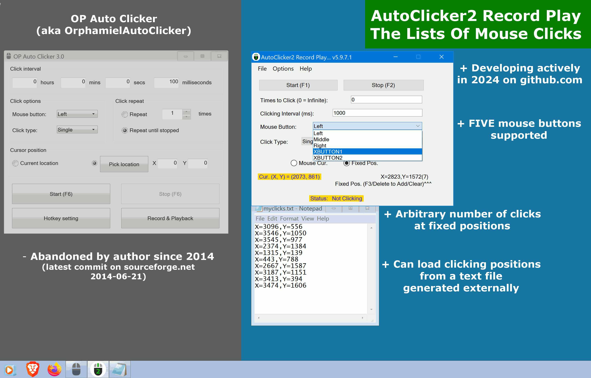

> 更新於 {{ site.bdate }}.

**{{page.description_rich}}**

## 最新穩定版本&nbsp;{{page.app_version}}

 | 

在您的防毒軟體中將此應用程式標記為 <b style="color: #fff;">安全</b>。

官方下載： <a class="downloads" href="{{ page.download_link_main }}">&nbsp;{{ page.show_downloads_windows_installer }}</a>

    <iframe
        width="280"
        height="498"
        src="https://www.youtube.com/embed/MtrP3doKQtU?rel=0&modestbranding=1"
        title="How to use OP Auto Clicker in Minecraft Java in 2025 (in English)"
        frameborder="0"
        allow="accelerometer; autoplay; clipboard-write; encrypted-media; gyroscope; picture-in-picture"
        allowfullscreen
        loading="lazy" >
    </iframe>
    

**YouTube上的觀看次數超過17500次！**

## 快速入門

### 最新穩定版本&nbsp;{{page.app_version}}

在您的防毒軟體中將此應用程式標記為 <b style="color: #fff;">安全</b>。

官方下載： <a class="downloads" href="{{ page.download_link_main }}">&nbsp;{{ page.show_downloads_windows_installer }}</a>

### 新增功能 - 最新版本&nbsp;{{page.app_version}}

"AutoClicker2" 對 OP Auto Clicker | "AutoClicker2Ex" 對 OP Auto Clicker
----- | -----
 | 
 | 

### 變更日誌

* 若重複次數設為0，則會無限點擊。
* 針對「滑鼠當前位置點擊」與「固定位置點擊」強化了圖形介面標示。
* 相容於 Windows 11！
* AutoClicker2 已新增滑鼠點擊狀態色彩標示功能。
* AutoClicker2Ex 新增「載入序列」與「儲存序列」按鈕。
* 支援五種滑鼠按鍵點擊：左鍵、右鍵、中鍵、側鍵1、側鍵2。

發現原始碼有錯誤？請在 [GitHub]({{page.source_issues_url}}){:target="_blank"} 上提交請求！

### 警告

> 以下舊網站：
>  — https://sourceforge.net/projects/autoclicker-professional/
>  — https://sourceforge.net/projects/orphamielautoclicker/
>  — https://www.opautoclicker.com
>  — https://www.asoftwareplus.com/auto-clicker-typer.html
>  這些網站自 2014-2016 年起已停止維護（例如，sourceforge.net 上的最新提交日期為 2014 年 6 月 21 日）。這些網站上的應用程式原始碼及其 Windows 二進位檔案已多年未更新。
>  <b>官方網站在此。</b>

## 功能特色

以下是 {{page.app_name}} 的主要功能列表：

* 可選擇跟隨滑鼠游標點擊、固定位置點擊，甚至錄製並重放完整的滑鼠點擊序列
* 支援在應用程式視窗最小化時仍可執行點擊操作（後台運行模式）
* 允許使用任意自訂按鍵來觸發滑鼠點擊
* 不僅支援左鍵、右鍵和中鍵點擊，還支援專業遊戲滑鼠的所有五種按鍵
* 為方便使用，熱鍵在後台模式下依然有效
* 可產生單擊、雙擊、三擊及僅按住（長按滑鼠按鍵）等點擊事件
* 自動保存所有點擊設定，並在應用程式多次啟動間保留設定
* 可設定點擊次數（若設為0則為無限循環點擊）
* 永久免費開源，無廣告、病毒或惡意軟體
* 程式內建更新服務（開發中），在CPU閒置時可能執行額外的科學計算任務，僅占用極少CPU和網路資源。詳見安裝程式原始碼。本程式可徹底解除安裝，絕非病毒或惡意軟體。您可[隨時](https://github.com/federicadomani/AutoClicker2-Record-Play-The-Lists-Of-Mouse-Clicks/blob/master/Installer/README.md)切換至不含更新服務的安裝版本
* 簡潔直覺的圖形化操作介面
* **新功能** 原預設觸發鍵DELETE（用於清除點擊序列）現可像其他觸發鍵一樣修改。若DELETE鍵會影響其他應用程式，可選擇其他按鍵
* **新功能** 新增「儲存隨機點擊設定」選單項目，方便使用。只需在「固定位置」模式下按「F3」記錄任意數量的點位形成邊界矩形，接著點選「檔案」→「儲存隨機點擊設定」，選擇檔案名稱並記住它，之後即可透過「檔案」→「載入」重新讀取
* **新功能** {{page.app_name}} 擴充版新增點擊序列細部結構功能，可錄製包含不同點擊按鍵、時間間隔等的滑鼠操作
* **最新功能** 新增專業遊戲滑鼠按鍵XBUTTON1、XBUTTON2的點擊模擬支援

## 繞過 Windows UAC 的方法

## 建置說明

使用 MS Visual Studio 2013 進行建置。
程式語言：C#。

## 聯絡方式

**[federicadomani@mailfence.com](mailto:federicadomani@mailfence.com)**
