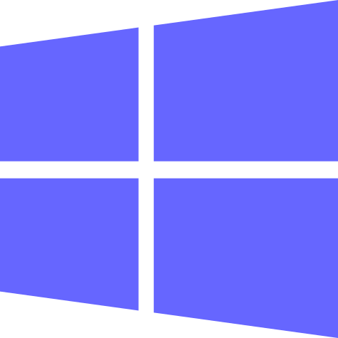

## My Projects

###  [AutoClicker2 Record Play (The Lists Of Mouse Clicks)](https://federicadomani.github.io/AutoClicker2-Record-Play/)

> Updated Jul 25 2024. Better GUI emphasizing for Mouse Cur./Fixed Pos. clicking. New version 5.9.7.1 works on Windows 11.
